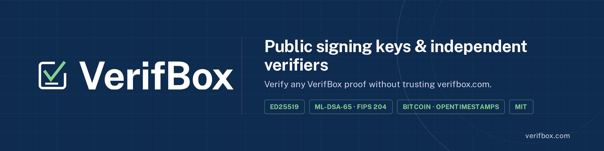
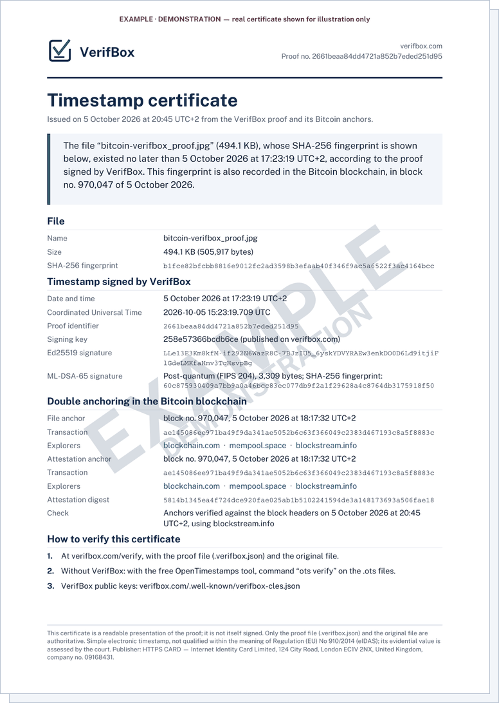

<p align="center">
  
</p>

<p align="center">
  <a href="https://verifbox.com">Website</a> ·
  <a href="https://verifbox.com/verify">Verify a proof</a> ·
  <a href="https://verifbox.com/specification">Specification</a> ·
  <a href="https://verifbox.com/fr">Français</a>
</p>

# VerifBox public signing keys

This repository publishes the public signing keys of **VerifBox** (https://verifbox.com), a file timestamping service operated by HTTPS CARD — Internet Identity Card Limited (company no. 09168431, London).

It exists so that anyone can check the VerifBox key file **without trusting verifbox.com alone**: the same fingerprint is published here, in the DNS of internetidentitycard.com (DNSSEC-signed), and on verifbox.com. A substituted key file would not match all three.

## What you get

<table>
<tr>
<td width="42%" valign="top">
<a href="https://verifbox.com/example-certificate-verifbox.pdf"></a>
<br><sub>Demonstration example based on a real proof, shown with an EXAMPLE watermark.</sub>
</td>
<td valign="top">
<p>Three files, each with its own role. You keep them: VerifBox keeps no copy.</p>
<p><strong>The proof</strong> <code>.verifbox.json</code><br>The authoritative document: the file’s fingerprint, the date and time, both signatures and, since 10 October 2026, the IIC TSA time-stamp token (RFC 3161). Issued immediately.</p>
<p><strong>The Bitcoin anchors</strong> <code>.ots</code><br>Two OpenTimestamps proofs, one for the file fingerprint and one for the signed attestation, recorded in the Bitcoin blockchain and verifiable without VerifBox. Completed within a few hours.</p>
<p><strong>The certificate</strong> <code>PDF</code><br>A readable presentation of everything, with links to the Bitcoin block and transaction, to attach to a file or send to an adviser. Available once the anchor is confirmed.</p>
<p><a href="https://verifbox.com/example-certificate-verifbox.pdf"><strong>View the example PDF →</strong></a></p>
</td>
</tr>
</table>

## Public demonstration proof

The [`demo/`](demo/) folder contains a real proof with the double Bitcoin anchoring (proof `2661beaa…`, block 970,047), its two `.ots` files and the commands to replay every check yourself, from the fingerprints alone.

## Current key

| | |
|---|---|
| Key identifier | `258e57366bcdb6ce` |
| Status | active |
| In service since | 2026-10-03 06:20 UTC |
| Algorithms | Ed25519 (RFC 8032) + ML-DSA-65 (NIST FIPS 204) |
| SHA-256 of `verifbox-cles.json` | `e0f8ef8020965dca46c973a84d5d78ff52c9580c1c5979886bab2cb0f15c565d` |

## Check the key file

```bash
curl -s https://verifbox.com/.well-known/verifbox-cles.json | shasum -a 256
dig +short TXT _verifbox.internetidentitycard.com
```

Both must show the fingerprint above, which must also match `verifbox-cles.json` in this repository.

## Verify a VerifBox proof

### Without any technical skill: the offline page

1. Download `verifbox-verify-offline.html` from this repository (button "Download raw file").
2. Double-click it: it opens in your browser, on Windows, Mac or Linux.
3. Drop the proof (`.verifbox.json`) and the original file.

The page works without any internet connection and cannot make any network request. The public key file is included in it **verbatim**, in the `<script type="application/json" id="cles-integrees">` block: the SHA-256 of the text between those two tags is exactly the fingerprint above. The page recomputes this fingerprint when it opens and shows it at the bottom, with a warning if it ever differed. Only the keys included in the page are trusted as roots: a key file loaded by hand can only add keys attested by a trusted key, or mark known keys as retired or revoked. It can never add a root key or lift a revocation. Such a file can therefore cause a proof to be refused, never to be accepted. The Bitcoin block number shown offline is read from the .ots file itself and is not verified against Bitcoin.

### In Python

```bash
pip install cryptography dilithium-py
python3 verifbox_verify.py proof.verifbox.json original-file --ots anchor.ots
```

The verifier (`verifbox_verify.py`, MIT licence) checks the file fingerprint, both signatures, the key lifecycle, the DNS publication and, when the proof carries one, the IIC TSA time-stamp token (signature, chain to the pinned IIC TSA root, time-stamping usage, revocation list), without contacting the VerifBox service. The VerifBox root key and the IIC TSA root certificate are pinned in the script by their SHA-256. Specification: https://verifbox.com/specification

## IIC TSA time-stamp token

Since 10 October 2026, each proof also carries an RFC 3161 time-stamp token over the file fingerprint, issued by **IIC TSA** (https://tsa.internetidentitycard.com/tsa). IIC TSA is operated by the same company as VerifBox and is not an independent third party; it is not an eIDAS-qualified trust service. Its root certificate (`IIC TSA Root R1`, SHA-256 `86:52:E3:D1:3E:72:5F:7C:75:7C:FA:05:3D:64:13:60:AC:A4:43:CF:6C:09:D7:D6:DD:D4:4B:EA:85:1E:D3:B9`) and the root revocation list are published at https://verifbox.com/.well-known/iic-tsa.json. To check a token with OpenSSL alone:

```bash
python3 verifbox_verify.py proof.verifbox.json original-file --tsr token.tsr
openssl ts -verify -data original-file -in token.tsr -CAfile iic-tsa-root.pem
```

Proofs issued before 10 October 2026 do not contain a token; they stay valid.

## Bundled cryptographic libraries

The offline page embeds the following libraries in **readable, unminified** form, each preceded by a `// node_modules/...` marker naming its source file, so that the code can be compared with the official npm packages (MIT licence, [noble](https://paulmillr.com/noble/) by Paul Miller):

| Package | Version | npm integrity |
|---|---|---|
| `@noble/post-quantum` (ML-DSA-65) | 0.7.1 | `sha512-+P9981IiAnVh+rmcubozzVwrEy3XsN/tMhTnvsjV9VDaYpOnNCqWqKo2FLWxbu92YHfjGIlE5XnW175UK+ln+Q==` |
| `@noble/curves` (Ed25519) | 2.4.0 | `sha512-P4/62zrgfH33CneE3Dn4WhJVA22YUU0eR51wKIan4NVRvwsA0YnPTwWGpNbpuacSujmSFLvyzpyuR30+fbq2Ew==` |
| `@noble/hashes` (SHA-256) | 2.4.0 | `sha512-X5XaVWZIBCT7HHZGm5I7ZQXDwLG+bGXuSrMQAW+7Zvl87h1kmc1ZB1VSRJcpUfoUrGQp4Fkoxm5kZ+Ms+aW+eA==` |

Revoked keys always fail in the offline page: without an internet connection, it cannot confirm that a Bitcoin anchor is really recorded in a block, so it cannot safely accept a proof signed by a revoked key. Use the Verify page of verifbox.com for that case.

## Key rotation

Keys are never deleted. On rotation, the old key signs the new one, the old key becomes `retiree`, and this repository, the DNS record and verifbox.com are updated together. The commit history of this repository is the public record of these changes.

---

# Clés publiques de signature de VerifBox

Ce dépôt publie les clés publiques de signature de **VerifBox** (https://verifbox.com), service d’horodatage de fichiers édité par HTTPS CARD — Internet Identity Card Limited (société n° 09168431, Londres).

Il permet de contrôler le fichier de clés de VerifBox **sans faire confiance au seul verifbox.com** : la même empreinte est publiée ici, dans le DNS d’internetidentitycard.com (signé par DNSSEC) et sur verifbox.com. Un fichier de clés substitué ne correspondrait pas aux trois.

**Ce que vous obtenez** : la preuve (`.verifbox.json`), qui fait foi et contient, depuis le 10 octobre 2026, le jeton d’horodatage IIC TSA (RFC 3161, vérifiable avec OpenSSL et la racine publiée sur verifbox.com/.well-known/iic-tsa.json ; IIC TSA est exploité par la même société que VerifBox) ; les deux ancrages Bitcoin (`.ots`), vérifiables sans VerifBox ; et un certificat PDF lisible, disponible une fois l’ancrage confirmé ([exemple](https://verifbox.com/exemple-certificat-verifbox.pdf)).

Clé actuelle : `258e57366bcdb6ce`, active depuis le 3 octobre 2026 à 06:20 UTC. Empreinte SHA-256 du fichier `verifbox-cles.json` : `e0f8ef8020965dca46c973a84d5d78ff52c9580c1c5979886bab2cb0f15c565d`.

**Vérifier une preuve sans compétence technique** (seules les clés intégrées à la page servent de racines de confiance) : téléchargez `verifbox-verify-offline.html` depuis ce dépôt, ouvrez-le d’un double-clic dans votre navigateur (Windows, Mac ou Linux), puis déposez la preuve (`.verifbox.json`) et le fichier d’origine. La page fonctionne sans connexion internet et ne peut envoyer aucune donnée sur le réseau. Son interface existe en français.

Autres méthodes : voir ci-dessus, ou https://verifbox.com/fr/specification
